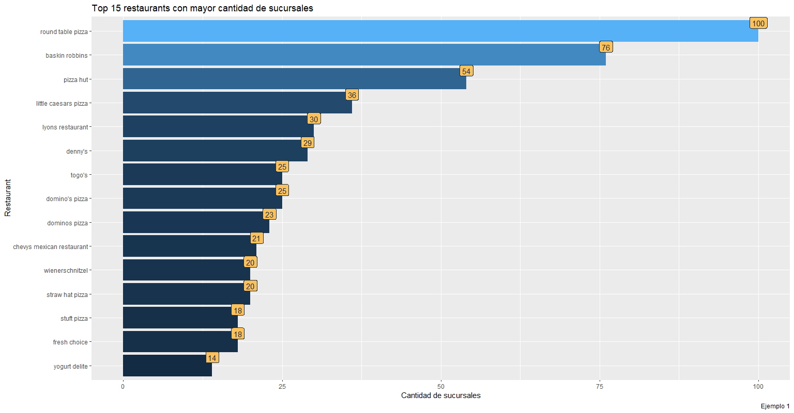
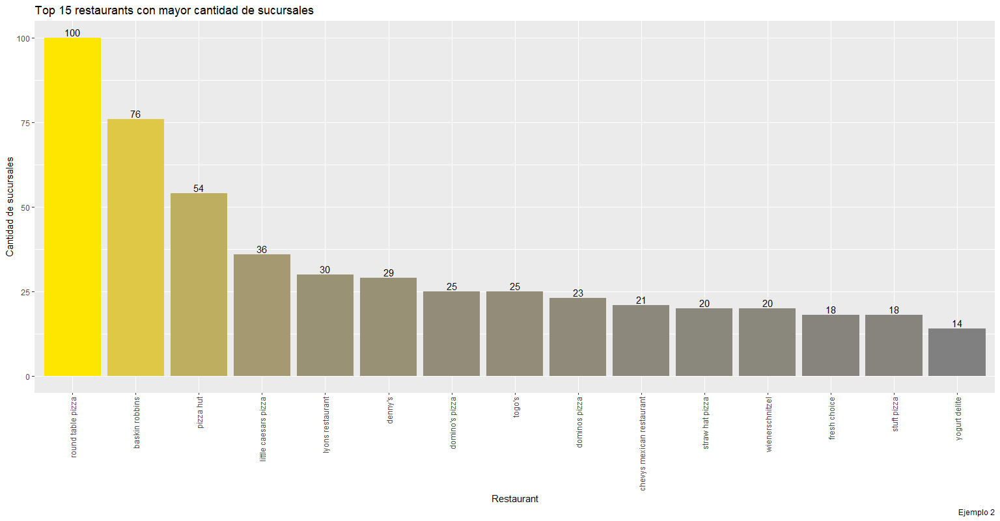
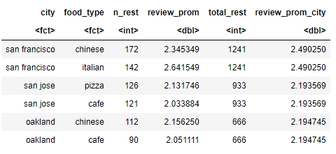
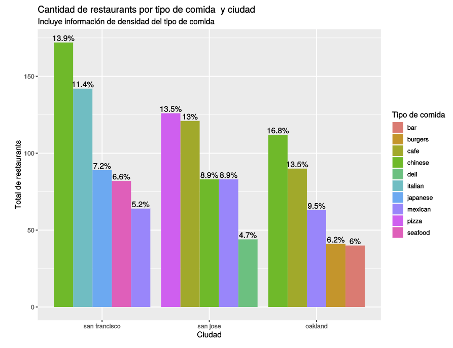

# Control 2: Manipulación de tablas y gráficos


Nombre 1: _Puede incluir su nombre acá haciendo doble click_                                                                                                                                      <br>
Nombre 2: _Puede incluir su nombre acá haciendo doble click_   

# Instrucciones

El siguiente test podrá desarrollarlo de manera individual o en pareja con otro(a) de sus compañeros(as).<br>

Lea atentamente cada una de las preguntas propuestas y sea claro en los comentarios (si es que los incluye) de los desarrollos de sus respuestas. Para el desarrollo de las mismas, dispone de celdas de código después de cada pregunta. Sin embargo podrá agregar más celdas si así lo estima conveniente.<br>
Las preguntas formuladas en este test pueden ser abordadas con las herramientas trabajadas en clases y en las sesiones de _ejercitación_, sin embaro, usted podrá hacer uso de las funcionalidades y/o packages que estime convenientes, a menos que se indique explícitamente lo contrario.

## Tiempo y entrega
Dispondrán hasta el día **domingo 02 de agosto** hasta las 23:59 hrs para hacer envío de sus respuestas.
Una vez finalizado el desarrollo del test, deberá entregarlo teniendo en cuenta las siguientes consideraciones :

 1. Descargue el notebook en **formato HTML** (uno por pareja), e indique en el nombre del archivo los nombres de los integrantes, Control1_nombres_integrantes.html.
    En caso de trabajar en Rstudio, deberá enviar el script de extensión *.R con el siguiente nombre: Control2_nombres_integrantes.R , **procurando indicar con comentarios claros, qué pregunta está respondiendo en cada caso**.
 * Envíe el archivo al correo angelubilla@gmail.com, con copia a majorquev@gmail.com con el asunto "DBDN-R-C2: 'nombre y apellido de los integrantes' "

**NOTA**:
   * Los correos cuyo asunto no comiencen con "DBDN-R-C2" no llegarán a destino y por ende no serán calificados.
   * Los archivos que no contengan nombre serán calificados con la nota mínima 1.0.
   * Los correos enviados posterior a la fecha y hora de entrega indicados tendrán una penalización de 1 punto por día (o fracción) de retraso en la entrega, por ejemplo, si usted envía sus respuestas a las 00:05 hrs del lunes 03 de agosto, su nota máxima será un 6.0.


# Sección 1

En la ruta `./datasets` se encuentran los siguientes arhivos, correspondiente a un sondeo de distintos restaurants de EE.UU y sus valoraciones.
El archivo `generalinfo.csv` contiene información propia del restaurant, como tipo de comida ofrecida y valoración de los clientes entre otros.

* `id_restaurant`: Identificador del restaurant valorado.
* `label`: Nombre del restaurant.
* `food_type`: Tipo de comida ofrecida por el restaurant.
* `review`: Calificación promedio del restaurant otorgada por los usuarios. (valor entre 0 y 1)

Por otra parte, la información contenida en el archivo `location.csv` es la siguiente:

* `id_rest`: Identificador del restaurant valorado.
* `street_num`: Numeración de la ubicación del restaurant.
* `street_name`: Nombre de la calle donde está ubicado el restaurant.
* `city`: Ciudad donde se ubica el restaurant.

Note que ambas tablas están relacionadas a través de los campos `id_restaurant` y `id_rest`.

## Preliminar
Cargue los archivos indicados previamente en dos variables, una llamada `general` y otra `location` para  `generalinfo.csv` y `location.csv` respectivamente.


```R
#########
## Esto  no es necesaria en Rstudio, es sólo para modificar el tamaño de los gráficos desplegados en el notebook
library(repr)
options(repr.plot.width=12, repr.plot.height=12)
#########

```

## Preguntas 1.1

**P1a) (1pt)** Basándose en a tabla _general_, ¿cuántos restaurants distintos hay en total?<br>
**P1b) (1pt)** ¿En cuántos tipos de comida diferentes se clasifican los restaurants?<br>
**P1c) (2pt)** ¿Cuántas ciudades distintas considera el sondeo?<br>
**P1d) (2pt)** ¿Indique el tipo de comida y las ciudades donde se encuentra el restaurant "great wall restaurant"?<br>
**P1e) (2pt)** ¿Cuántos restaurantes de la ciudad de _san francisco_ tienen calificación mayor o igual a 3.8 y venden comida vegetariana (_vegetarian_) ?<br>


```R
# P1.1
## Respusta

```

## Preguntas 1.2

**P2a) (2pt)** Sin considerar San Francisco, ¿cuál es la ciudad con mayor cantidad de restaurantes sondeados?<br>
**P2b) (1pt)** ¿Cuáles son los 3 tipos de comida ofrecido más comunes ?<br>
**P2c) (2pt)** Sin con siderar San Francisco, ¿Cuáles son las 3 ciudades con mayor cantidad de restaurants que ofrecen comido tipo _japanese_?<br>
**P2d) (2pt)** Usted decide viajar a una de las ciudades en cuestión, para ello calcula el promedio de las valoraciones medias (promedio de _review_) por cada ciudad, y escoje aquella con mayor review promedio. ¿Qué ciudad escoge? <br>
**P2e) (2pt)** Cuál es la ciudad con mejor valoración promedio de restaurantes tipo "barbeque"<br>


```R
# P1.2
## Respusta

```

## Preguntas 1.3
**P3a) (4pt)** En la pregunta 1d), se pudo observar que un mismo restaurant puede estar presente en más de una ciudad. ¿Cuántos restaurants tienen esta característica, es decir están en más de una ciudad **distinta** ? De ser de utilidad puede investigar y utilizar la función `distinct()`.<br>
**P3b) (2pt)** ¿Cuál es el restaurant que tiene presencia en la mayor cantidad de **ciudades distintas**?¿En cuántas ciudades está presente?<br>
**P3c) (5pt)** Diremos que un restaurant posee _sucursales_ si en la tabla `general` existe más de un registro con el mismo `label`. Muestre, mediante un gráfico de barras, los 15 restaurants con  mayor cantidad de _sucursales_, donde la altura de la barra representa el total de sucursales de cada restaurant. Su gráfico debe contemplar al menos los siguientes aspectos:
 * Debe contener un título.
 * Debe incluir nombres sugerentes en los ejes.
 * Los nombres de los restaurants deben ser legibles.
 * Los restaurants deben ir ordenados según su cantidad de sucursales.
 * Incluya tiquetas en la parte superior de cada barra, que muestre la cantidad de sucursales respectivas.
 * Las leyendas de cada gráfico no deben visualizarse

Como ayuda, puede ser de utilidad investigar la usabilidad de las siguientes funciones de ggplot2.
  * `labs()`
  * `geom_label()`; `geom_text()`
  * `reorder()`
  * `coord_flip()`
  * `theme()` en conjunto con `element_text()`

 A modo de ejemplo puede tener como referencia los siguientes gráficos.


 
 


```R
# P1.3
## Respusta


```

## Preguntas 1.4

**P4a) (4pts)** Genere una tabla llamada `resumen`, que contenga la siguiente información:

 * `city`: Ciudad
 * `food_type`: Tipo de comida
 * `n_rest`: Cantidad de restaurantes por cada ciudad y tipo de comida.
 * `review_prom`: Valoración promedio por cada ciudad y tipo de comida.
 * `total_rest`: Total de restaurantes por cada ciudad (se puede repetir el valor por cada tipo de comida).
 * `review_prom_city`: Valoración promedio de los restaurantes por cada ciudad (se puede repetir el valor por cada tipo de comida).

Su tabla deberá tener la siguiente estructura:



**P4b) (2pts)** Basado en la tabla anterior, construya dos nuevas columnas llamadas `density_food_type` y `ratio_review` que contengan la siguiente información:

 * `density_food_type`: Representa el cuociente entre le total de restaurants por tipo de comida y ciudad, respecto del total de restaurantes de la ciudad. (`n_rest/total_rest`)
 * `ratio_review`: Representa el cociente entre a valoración del restaurant por tipo de comida y ciudad, respecto de la valoración promedio de los resturants de la misma ciudad. (`review_prom/review_prom_city`)

**P4c) (3pts)** Mediante un gráfico de dispersión, muestre la relación entre `density_food_type` y `ratio_review`. Investigue sobre el parámetro `alpha` dentro de la capa geométrica para una mejor visualizaciónd de los puntos. Adicionalmente añada una curva de tendencia y, con base en él, indique si cabe la posibilidad de establecer algún tipo de dependencia entre `density_food_type` y `ratio_review`.


```R
# P1.4
## Respusta

```

## Preguntas 1.5
**P5a) (3pts)** En la tabla `resumen` creada en **P4a)**, genere una nueva columna llamada `type_review`, que contenga "review alto", si `ratio_review >= 1` y "review bajo"  `ratio_review < 1`. ¿Qué indica esta variable? Comente.  <br>
**P5b) (3pts)** Para cada `type_review`, muestre a través de un gráfico de cajas (boxplot), la distribución de la densidad del tipo de comida`density_food_type`. ¿Qué puede observar?<br>


```R
#########
## Esto  no es necesaria en Rstudio, es sólo para modificar el tamaño de los gráficos desplegados en el notebook
options(repr.plot.width=9, repr.plot.height = 9)
#########

# P1.5
## Respusta
```

## Pregunta 1.6

**P6a) (2pts)** Determine cuáles son las iguientes ciudades:
 * Ciudad 1: Ciudad con mayor cantidad de restaurants (posición 1).
 * Ciudad 2: Ciudad ubicada en la posición 5, al ordenar las ciudades de manera decreciente según cantidad de restaurants.
 * Ciudad 3: Ciudad ubicada en la posición 10, al ordenar las ciudades de manera decreciente según cantidad de restaurants. <br>

**P6b) (6pts)** Usted deberá graficar la cantidad de restaurants, por cada uno de los **5 tipos de comida más frecuentes** dentro de la ciudad respectiva. Las ciudades graficadas deben corresponder, de izquierda a derecha, a las ciudades de posición 1,5 y 10 encontradas en **P6a)**. Al generar el gráfico, deberá tener en cuenta los siguientes elementos. <br>

  * Investigue sobre el parámetro `position` dentro de la capa geométrica que genera el gráfico de barras, para la correcta presentación de las mismas.
  * Por cada ciudad, sólo se grafican los 5 tipos de comida más frecuentes (con mayor cantidad de restaurants de dicho tipo).
  * EL gráfico deberá mostrar las barras ordenadas por altura tal cual se muestra en la imagen. De ser de utilidad, puede investigar el parámetro `group` dentro de la función `aes()`.
  * Debe incluir título, nombre de los ejes y nombre de la leyenda, tal como se muestra en la imagen.
  * Incluya etiquetas en la parte superior de cada barra. Estas etiquetas deberán mostrar la densidad del tipo de comida `density_food_type`, expresado como porccentaje (ie. density_food_type*100 %). Para tal efecto, investigue sobre la utilización de las funciones geom_label() o geom_text().


**NOTA:** Como referencia, su gráfico debe contener los mismos elementos del que se muestra a continuación (no necesariamente los mismos valores de los elementos que lo componen). Por otro lado, no es necesaria la utilización de la misma paleta de colores. En este gráfico se muestran las ciudades de posición 1,2 y 3. Ustede **deberá visualizar las 1, 5 y 10**.





```R
# P1.6
## Respusta

```
