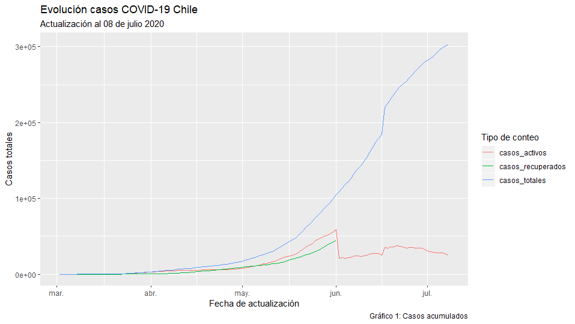
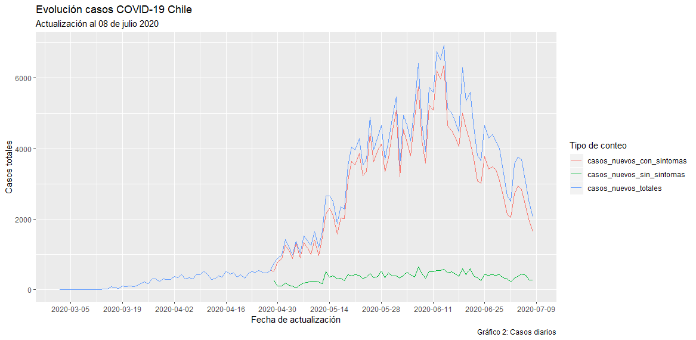
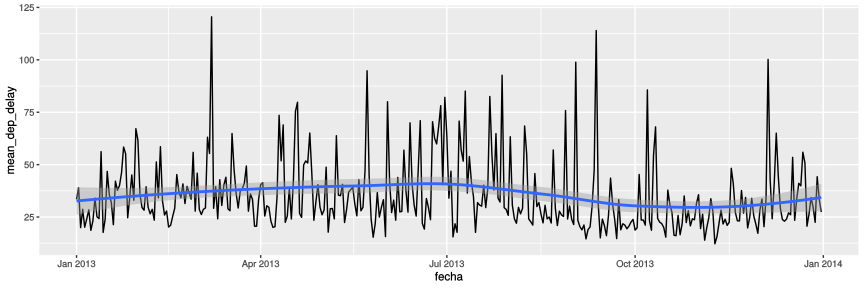

# Mini Taller 2
**Autor:** Miguel Jorquera Viguera.<br>
**E-mail:** majorquev@gmail.com<br>
**Ayudante:** Ángel Ubilla <br>
**E-mail ayudante:** angelubilla@gmail.com

## Sección 1

Cargue los datos correspondientes a la evolución de  los contagios por COVID-19 en nuestro país (archivo casos_diarios_covid.csv) ubicado en la ruta de este notebok. 

Usted deberá reproducir el siguiente gráfico. Para ello, investigue cómo añadir elementos como: Nombre de los ejes, título y leyendas. 
Adicionalmente, deberá tener en consideración los siguiente:


1. Deberá crear una nueva columna llamada `fecha` que contenga a la fecha en formato Date (puede utilizar la función `as.Date()`) en formato `yyyy-mm-dd`.
* Note que en el segundo gráfico, en el eje de las abcisas se muestran las fechas cada 14 días. Investigue el `comando scale_x_date` para modificar dicho parámetro.

Para mayor información sobre las distintas opciones gráficas de ggplot puede consultar la siguiente referencia:
https://ggplot2.tidyverse.org/index.html







## Sección 2
En esta sección seguiremos explorando los vuelos desde los aeropuertos de NY durante el 2013. En esta ocasión cargaremos los datasets desde el package _nycflights13_.

Para mayor informacíón sobre los datasets disponibles en este package  refiérase al iguiente link 
** https://cran.r-project.org/web/packages/nycflights13/nycflights13.pdf **


```R
data("flights", package = "nycflights13")
data("weather", package = "nycflights13")
vuelos <- flights
clima <- weather
```


```R
library(dplyr)
library(ggplot2)
```

## P1. Resumen retrasos 
Genere un resumen de la variable dep_delay del dataset _flights_.

## P2. Retrasos por aeropuerto
¿Cuál es el tiempo promedio de retraso de  llegada por cada aeropuerto de origen?

## P3. Tratamiento  NA's 
Elimine los registros donde *dep_delay* es NA  y también elimine los registros donde *arr_delay* es NA.

## P4. Vuelos con retrasos 
**a)** Genere un nuevo dataset llamado **vuelos_ret** que contenga todos los registros que tuvieron un  **retraso de salida**. Tenga en cuenta que ya debió tratar los NA's de la pregunta anterior y por ende están considerados en esta etapa.

**b)** Considerando el dataset anterior, ¿cuál es el retraso promedio de salida por aeropuerto de origen?

## P5. Retrasos por dia 
Genere un campo fecha en formato Date (puede utilizar la función as.Date()) que contenga la fecha del vuelo en formato "yyyy-mm-dd".

**a)** Una vez generado este nuevo campo, genere un gráfico que permita visualizar el retraso **promedio** de salida (*dep_delay*), por cada día. Por ejemplo, un gráfico de líneas.

**b)** Considerando el gráfico anterior, añada una curva de tendencia y determine (visualmente) si exsten meses con un alza notoria en relación a los retrasos de los vuelos.


## P6. Cruce con clima 
Se tiene la hipótesis de que el clima puede ser un factor importante en los retrasos, para ello cargue el dataset llamado "weather" del package "nycflights13"

**a)** Genere un dataset llamado *vuelos_ret_ampliado* que incluya tanto la información de los vuelos como del clima. (el match debe hacerse por "year","month","day","origin","time_hour").

## P7. Retrasos 15 min

Cree una columna de **tipo int** llamada *arr_delay_alto*, que tome el valor 1 si el retraso de llegada es mayor o igual a 15 min y 0 en caso contrario. De ahora en adelante diremos que esta columna indica si existió un _retraso alto_ o no.

## P8. Clima según retraso alto (4P)
    
**a)** ¿Cuál es la visibilidad (visib) promedio por tipo de retraso (alto y no alto)?

**b)** ¿Cuál es el valor de la precipitacion (precip) media por tipo de retraso (alto y no alto)?

**c)** ¿Cuál es el valor promedio de wind_gust (vientos fuertes)  por tipo de retraso?

**d)** ¿Qué se observa a partir del resumen anterior?

 ## P9. Tasa de retrasos (2P)
**a)** ¿Cuál es el aeropuerto de destino con mayor tasa de retrasos altos (arr_delay_alto) ? 

**b)** ¿Cuál es el mes con mayor tasa de retrasos altos?

# Respuestas


```R
# P1
summary(vuelos$dep_delay)
```


```R
# P2
vuelos %>%
    group_by(origin) %>% 
    summarise(m_arr_del = mean(arr_delay,na.rm=T))
```


```R
# P3 
library(dplyr)
vuelos %>% 
    filter(!is.na(dep_delay) & !is.na(arr_delay) ) 
```


<table>
<caption>A tibble: 328521 x 19</caption>
<thead>
	<tr><th scope=col>year</th><th scope=col>month</th><th scope=col>day</th><th scope=col>dep_time</th><th scope=col>sched_dep_time</th><th scope=col>dep_delay</th><th scope=col>arr_time</th><th scope=col>sched_arr_time</th><th scope=col>arr_delay</th><th scope=col>carrier</th><th scope=col>flight</th><th scope=col>tailnum</th><th scope=col>origin</th><th scope=col>dest</th><th scope=col>air_time</th><th scope=col>distance</th><th scope=col>hour</th><th scope=col>minute</th><th scope=col>time_hour</th></tr>
	<tr><th scope=col>&lt;int&gt;</th><th scope=col>&lt;int&gt;</th><th scope=col>&lt;int&gt;</th><th scope=col>&lt;int&gt;</th><th scope=col>&lt;int&gt;</th><th scope=col>&lt;dbl&gt;</th><th scope=col>&lt;int&gt;</th><th scope=col>&lt;int&gt;</th><th scope=col>&lt;dbl&gt;</th><th scope=col>&lt;chr&gt;</th><th scope=col>&lt;int&gt;</th><th scope=col>&lt;chr&gt;</th><th scope=col>&lt;chr&gt;</th><th scope=col>&lt;chr&gt;</th><th scope=col>&lt;dbl&gt;</th><th scope=col>&lt;dbl&gt;</th><th scope=col>&lt;dbl&gt;</th><th scope=col>&lt;dbl&gt;</th><th scope=col>&lt;dttm&gt;</th></tr>
</thead>
<tbody>
	<tr><td>2013</td><td>1</td><td>1</td><td>517</td><td>515</td><td> 2</td><td> 830</td><td> 819</td><td> 11</td><td>UA</td><td>1545</td><td>N14228</td><td>EWR</td><td>IAH</td><td>227</td><td>1400</td><td>5</td><td>15</td><td>2013-01-01 05:00:00</td></tr>
	<tr><td>2013</td><td>1</td><td>1</td><td>533</td><td>529</td><td> 4</td><td> 850</td><td> 830</td><td> 20</td><td>UA</td><td>1714</td><td>N24211</td><td>LGA</td><td>IAH</td><td>227</td><td>1416</td><td>5</td><td>29</td><td>2013-01-01 05:00:00</td></tr>
	<tr><td>2013</td><td>1</td><td>1</td><td>542</td><td>540</td><td> 2</td><td> 923</td><td> 850</td><td> 33</td><td>AA</td><td>1141</td><td>N619AA</td><td>JFK</td><td>MIA</td><td>160</td><td>1089</td><td>5</td><td>40</td><td>2013-01-01 05:00:00</td></tr>
	<tr><td>2013</td><td>1</td><td>1</td><td>544</td><td>545</td><td>-1</td><td>1004</td><td>1022</td><td>-18</td><td>B6</td><td> 725</td><td>N804JB</td><td>JFK</td><td>BQN</td><td>183</td><td>1576</td><td>5</td><td>45</td><td>2013-01-01 05:00:00</td></tr>
	<tr><td>2013</td><td>1</td><td>1</td><td>554</td><td>600</td><td>-6</td><td> 812</td><td> 837</td><td>-25</td><td>DL</td><td> 461</td><td>N668DN</td><td>LGA</td><td>ATL</td><td>116</td><td> 762</td><td>6</td><td> 0</td><td>2013-01-01 06:00:00</td></tr>
	<tr><td>2013</td><td>1</td><td>1</td><td>554</td><td>558</td><td>-4</td><td> 740</td><td> 728</td><td> 12</td><td>UA</td><td>1696</td><td>N39463</td><td>EWR</td><td>ORD</td><td>150</td><td> 719</td><td>5</td><td>58</td><td>2013-01-01 05:00:00</td></tr>
	<tr><td>2013</td><td>1</td><td>1</td><td>555</td><td>600</td><td>-5</td><td> 913</td><td> 854</td><td> 19</td><td>B6</td><td> 507</td><td>N516JB</td><td>EWR</td><td>FLL</td><td>158</td><td>1065</td><td>6</td><td> 0</td><td>2013-01-01 06:00:00</td></tr>
	<tr><td>2013</td><td>1</td><td>1</td><td>557</td><td>600</td><td>-3</td><td> 709</td><td> 723</td><td>-14</td><td>EV</td><td>5708</td><td>N829AS</td><td>LGA</td><td>IAD</td><td> 53</td><td> 229</td><td>6</td><td> 0</td><td>2013-01-01 06:00:00</td></tr>
	<tr><td>2013</td><td>1</td><td>1</td><td>557</td><td>600</td><td>-3</td><td> 838</td><td> 846</td><td> -8</td><td>B6</td><td>  79</td><td>N593JB</td><td>JFK</td><td>MCO</td><td>140</td><td> 944</td><td>6</td><td> 0</td><td>2013-01-01 06:00:00</td></tr>
	<tr><td>2013</td><td>1</td><td>1</td><td>558</td><td>600</td><td>-2</td><td> 753</td><td> 745</td><td>  8</td><td>AA</td><td> 301</td><td>N3ALAA</td><td>LGA</td><td>ORD</td><td>138</td><td> 733</td><td>6</td><td> 0</td><td>2013-01-01 06:00:00</td></tr>
	<tr><td>2013</td><td>1</td><td>1</td><td>558</td><td>600</td><td>-2</td><td> 849</td><td> 851</td><td> -2</td><td>B6</td><td>  49</td><td>N793JB</td><td>JFK</td><td>PBI</td><td>149</td><td>1028</td><td>6</td><td> 0</td><td>2013-01-01 06:00:00</td></tr>
	<tr><td>2013</td><td>1</td><td>1</td><td>558</td><td>600</td><td>-2</td><td> 853</td><td> 856</td><td> -3</td><td>B6</td><td>  71</td><td>N657JB</td><td>JFK</td><td>TPA</td><td>158</td><td>1005</td><td>6</td><td> 0</td><td>2013-01-01 06:00:00</td></tr>
	<tr><td>2013</td><td>1</td><td>1</td><td>558</td><td>600</td><td>-2</td><td> 924</td><td> 917</td><td>  7</td><td>UA</td><td> 194</td><td>N29129</td><td>JFK</td><td>LAX</td><td>345</td><td>2475</td><td>6</td><td> 0</td><td>2013-01-01 06:00:00</td></tr>
	<tr><td>2013</td><td>1</td><td>1</td><td>558</td><td>600</td><td>-2</td><td> 923</td><td> 937</td><td>-14</td><td>UA</td><td>1124</td><td>N53441</td><td>EWR</td><td>SFO</td><td>361</td><td>2565</td><td>6</td><td> 0</td><td>2013-01-01 06:00:00</td></tr>
	<tr><td>2013</td><td>1</td><td>1</td><td>559</td><td>600</td><td>-1</td><td> 941</td><td> 910</td><td> 31</td><td>AA</td><td> 707</td><td>N3DUAA</td><td>LGA</td><td>DFW</td><td>257</td><td>1389</td><td>6</td><td> 0</td><td>2013-01-01 06:00:00</td></tr>
	<tr><td>2013</td><td>1</td><td>1</td><td>559</td><td>559</td><td> 0</td><td> 702</td><td> 706</td><td> -4</td><td>B6</td><td>1806</td><td>N708JB</td><td>JFK</td><td>BOS</td><td> 44</td><td> 187</td><td>5</td><td>59</td><td>2013-01-01 05:00:00</td></tr>
	<tr><td>2013</td><td>1</td><td>1</td><td>559</td><td>600</td><td>-1</td><td> 854</td><td> 902</td><td> -8</td><td>UA</td><td>1187</td><td>N76515</td><td>EWR</td><td>LAS</td><td>337</td><td>2227</td><td>6</td><td> 0</td><td>2013-01-01 06:00:00</td></tr>
	<tr><td>2013</td><td>1</td><td>1</td><td>600</td><td>600</td><td> 0</td><td> 851</td><td> 858</td><td> -7</td><td>B6</td><td> 371</td><td>N595JB</td><td>LGA</td><td>FLL</td><td>152</td><td>1076</td><td>6</td><td> 0</td><td>2013-01-01 06:00:00</td></tr>
	<tr><td>2013</td><td>1</td><td>1</td><td>600</td><td>600</td><td> 0</td><td> 837</td><td> 825</td><td> 12</td><td>MQ</td><td>4650</td><td>N542MQ</td><td>LGA</td><td>ATL</td><td>134</td><td> 762</td><td>6</td><td> 0</td><td>2013-01-01 06:00:00</td></tr>
	<tr><td>2013</td><td>1</td><td>1</td><td>601</td><td>600</td><td> 1</td><td> 844</td><td> 850</td><td> -6</td><td>B6</td><td> 343</td><td>N644JB</td><td>EWR</td><td>PBI</td><td>147</td><td>1023</td><td>6</td><td> 0</td><td>2013-01-01 06:00:00</td></tr>
	<tr><td>2013</td><td>1</td><td>1</td><td>602</td><td>610</td><td>-8</td><td> 812</td><td> 820</td><td> -8</td><td>DL</td><td>1919</td><td>N971DL</td><td>LGA</td><td>MSP</td><td>170</td><td>1020</td><td>6</td><td>10</td><td>2013-01-01 06:00:00</td></tr>
	<tr><td>2013</td><td>1</td><td>1</td><td>602</td><td>605</td><td>-3</td><td> 821</td><td> 805</td><td> 16</td><td>MQ</td><td>4401</td><td>N730MQ</td><td>LGA</td><td>DTW</td><td>105</td><td> 502</td><td>6</td><td> 5</td><td>2013-01-01 06:00:00</td></tr>
	<tr><td>2013</td><td>1</td><td>1</td><td>606</td><td>610</td><td>-4</td><td> 858</td><td> 910</td><td>-12</td><td>AA</td><td>1895</td><td>N633AA</td><td>EWR</td><td>MIA</td><td>152</td><td>1085</td><td>6</td><td>10</td><td>2013-01-01 06:00:00</td></tr>
	<tr><td>2013</td><td>1</td><td>1</td><td>606</td><td>610</td><td>-4</td><td> 837</td><td> 845</td><td> -8</td><td>DL</td><td>1743</td><td>N3739P</td><td>JFK</td><td>ATL</td><td>128</td><td> 760</td><td>6</td><td>10</td><td>2013-01-01 06:00:00</td></tr>
	<tr><td>2013</td><td>1</td><td>1</td><td>607</td><td>607</td><td> 0</td><td> 858</td><td> 915</td><td>-17</td><td>UA</td><td>1077</td><td>N53442</td><td>EWR</td><td>MIA</td><td>157</td><td>1085</td><td>6</td><td> 7</td><td>2013-01-01 06:00:00</td></tr>
	<tr><td>2013</td><td>1</td><td>1</td><td>608</td><td>600</td><td> 8</td><td> 807</td><td> 735</td><td> 32</td><td>MQ</td><td>3768</td><td>N9EAMQ</td><td>EWR</td><td>ORD</td><td>139</td><td> 719</td><td>6</td><td> 0</td><td>2013-01-01 06:00:00</td></tr>
	<tr><td>2013</td><td>1</td><td>1</td><td>611</td><td>600</td><td>11</td><td> 945</td><td> 931</td><td> 14</td><td>UA</td><td> 303</td><td>N532UA</td><td>JFK</td><td>SFO</td><td>366</td><td>2586</td><td>6</td><td> 0</td><td>2013-01-01 06:00:00</td></tr>
	<tr><td>2013</td><td>1</td><td>1</td><td>613</td><td>610</td><td> 3</td><td> 925</td><td> 921</td><td>  4</td><td>B6</td><td> 135</td><td>N635JB</td><td>JFK</td><td>RSW</td><td>175</td><td>1074</td><td>6</td><td>10</td><td>2013-01-01 06:00:00</td></tr>
	<tr><td>2013</td><td>1</td><td>1</td><td>615</td><td>615</td><td> 0</td><td>1039</td><td>1100</td><td>-21</td><td>B6</td><td> 709</td><td>N794JB</td><td>JFK</td><td>SJU</td><td>182</td><td>1598</td><td>6</td><td>15</td><td>2013-01-01 06:00:00</td></tr>
	<tr><td>2013</td><td>1</td><td>1</td><td>615</td><td>615</td><td> 0</td><td> 833</td><td> 842</td><td> -9</td><td>DL</td><td> 575</td><td>N326NB</td><td>EWR</td><td>ATL</td><td>120</td><td> 746</td><td>6</td><td>15</td><td>2013-01-01 06:00:00</td></tr>
	<tr><td>...</td><td>...</td><td>...</td><td>...</td><td>...</td><td>...</td><td>...</td><td>...</td><td>...</td><td>...</td><td>...</td><td>...</td><td>...</td><td>...</td><td>...</td><td>...</td><td>...</td><td>...</td><td>...</td></tr>
	<tr><td>2013</td><td>9</td><td>30</td><td>2115</td><td>2110</td><td>  5</td><td>2246</td><td>2255</td><td> -9</td><td>MQ</td><td>3603</td><td>N519MQ</td><td>LGA</td><td>DTW</td><td> 72</td><td> 502</td><td>21</td><td>10</td><td>2013-09-30 21:00:00</td></tr>
	<tr><td>2013</td><td>9</td><td>30</td><td>2116</td><td>2124</td><td> -8</td><td>2317</td><td>2337</td><td>-20</td><td>EV</td><td>4682</td><td>N14542</td><td>EWR</td><td>SDF</td><td> 94</td><td> 642</td><td>21</td><td>24</td><td>2013-09-30 21:00:00</td></tr>
	<tr><td>2013</td><td>9</td><td>30</td><td>2119</td><td>2005</td><td> 74</td><td>2310</td><td>2212</td><td> 58</td><td>EV</td><td>4321</td><td>N17984</td><td>EWR</td><td>MCI</td><td>147</td><td>1092</td><td>20</td><td> 5</td><td>2013-09-30 20:00:00</td></tr>
	<tr><td>2013</td><td>9</td><td>30</td><td>2119</td><td>2120</td><td> -1</td><td>2330</td><td>2354</td><td>-24</td><td>B6</td><td>1677</td><td>N358JB</td><td>JFK</td><td>JAX</td><td>113</td><td> 828</td><td>21</td><td>20</td><td>2013-09-30 21:00:00</td></tr>
	<tr><td>2013</td><td>9</td><td>30</td><td>2121</td><td>2100</td><td> 21</td><td>2349</td><td>  14</td><td>-25</td><td>DL</td><td>2363</td><td>N193DN</td><td>JFK</td><td>LAX</td><td>296</td><td>2475</td><td>21</td><td> 0</td><td>2013-09-30 21:00:00</td></tr>
	<tr><td>2013</td><td>9</td><td>30</td><td>2122</td><td>2127</td><td> -5</td><td>2226</td><td>2237</td><td>-11</td><td>EV</td><td>4372</td><td>N14902</td><td>EWR</td><td>DCA</td><td> 35</td><td> 199</td><td>21</td><td>27</td><td>2013-09-30 21:00:00</td></tr>
	<tr><td>2013</td><td>9</td><td>30</td><td>2123</td><td>2125</td><td> -2</td><td>2223</td><td>2247</td><td>-24</td><td>EV</td><td>5489</td><td>N712EV</td><td>LGA</td><td>CHO</td><td> 45</td><td> 305</td><td>21</td><td>25</td><td>2013-09-30 21:00:00</td></tr>
	<tr><td>2013</td><td>9</td><td>30</td><td>2127</td><td>2129</td><td> -2</td><td>2314</td><td>2323</td><td> -9</td><td>EV</td><td>3833</td><td>N16546</td><td>EWR</td><td>CLT</td><td> 72</td><td> 529</td><td>21</td><td>29</td><td>2013-09-30 21:00:00</td></tr>
	<tr><td>2013</td><td>9</td><td>30</td><td>2128</td><td>2130</td><td> -2</td><td>2328</td><td>2359</td><td>-31</td><td>B6</td><td>  97</td><td>N807JB</td><td>JFK</td><td>DEN</td><td>213</td><td>1626</td><td>21</td><td>30</td><td>2013-09-30 21:00:00</td></tr>
	<tr><td>2013</td><td>9</td><td>30</td><td>2129</td><td>2059</td><td> 30</td><td>2230</td><td>2232</td><td> -2</td><td>EV</td><td>5048</td><td>N751EV</td><td>LGA</td><td>RIC</td><td> 45</td><td> 292</td><td>20</td><td>59</td><td>2013-09-30 20:00:00</td></tr>
	<tr><td>2013</td><td>9</td><td>30</td><td>2131</td><td>2140</td><td> -9</td><td>2225</td><td>2255</td><td>-30</td><td>MQ</td><td>3621</td><td>N807MQ</td><td>JFK</td><td>DCA</td><td> 36</td><td> 213</td><td>21</td><td>40</td><td>2013-09-30 21:00:00</td></tr>
	<tr><td>2013</td><td>9</td><td>30</td><td>2140</td><td>2140</td><td>  0</td><td>  10</td><td>  40</td><td>-30</td><td>AA</td><td> 185</td><td>N335AA</td><td>JFK</td><td>LAX</td><td>298</td><td>2475</td><td>21</td><td>40</td><td>2013-09-30 21:00:00</td></tr>
	<tr><td>2013</td><td>9</td><td>30</td><td>2142</td><td>2129</td><td> 13</td><td>2250</td><td>2239</td><td> 11</td><td>EV</td><td>4509</td><td>N12957</td><td>EWR</td><td>PWM</td><td> 47</td><td> 284</td><td>21</td><td>29</td><td>2013-09-30 21:00:00</td></tr>
	<tr><td>2013</td><td>9</td><td>30</td><td>2145</td><td>2145</td><td>  0</td><td> 115</td><td> 140</td><td>-25</td><td>B6</td><td>1103</td><td>N633JB</td><td>JFK</td><td>SJU</td><td>192</td><td>1598</td><td>21</td><td>45</td><td>2013-09-30 21:00:00</td></tr>
	<tr><td>2013</td><td>9</td><td>30</td><td>2147</td><td>2137</td><td> 10</td><td>  30</td><td>  27</td><td>  3</td><td>B6</td><td>1371</td><td>N627JB</td><td>LGA</td><td>FLL</td><td>139</td><td>1076</td><td>21</td><td>37</td><td>2013-09-30 21:00:00</td></tr>
	<tr><td>2013</td><td>9</td><td>30</td><td>2149</td><td>2156</td><td> -7</td><td>2245</td><td>2308</td><td>-23</td><td>UA</td><td> 523</td><td>N813UA</td><td>EWR</td><td>BOS</td><td> 37</td><td> 200</td><td>21</td><td>56</td><td>2013-09-30 21:00:00</td></tr>
	<tr><td>2013</td><td>9</td><td>30</td><td>2150</td><td>2159</td><td> -9</td><td>2250</td><td>2306</td><td>-16</td><td>EV</td><td>3842</td><td>N10575</td><td>EWR</td><td>MHT</td><td> 39</td><td> 209</td><td>21</td><td>59</td><td>2013-09-30 21:00:00</td></tr>
	<tr><td>2013</td><td>9</td><td>30</td><td>2159</td><td>1845</td><td>194</td><td>2344</td><td>2030</td><td>194</td><td>9E</td><td>3320</td><td>N906XJ</td><td>JFK</td><td>BUF</td><td> 50</td><td> 301</td><td>18</td><td>45</td><td>2013-09-30 18:00:00</td></tr>
	<tr><td>2013</td><td>9</td><td>30</td><td>2203</td><td>2205</td><td> -2</td><td>2339</td><td>2331</td><td>  8</td><td>EV</td><td>5311</td><td>N722EV</td><td>LGA</td><td>BGR</td><td> 61</td><td> 378</td><td>22</td><td> 5</td><td>2013-09-30 22:00:00</td></tr>
	<tr><td>2013</td><td>9</td><td>30</td><td>2207</td><td>2140</td><td> 27</td><td>2257</td><td>2250</td><td>  7</td><td>MQ</td><td>3660</td><td>N532MQ</td><td>LGA</td><td>BNA</td><td> 97</td><td> 764</td><td>21</td><td>40</td><td>2013-09-30 21:00:00</td></tr>
	<tr><td>2013</td><td>9</td><td>30</td><td>2211</td><td>2059</td><td> 72</td><td>2339</td><td>2242</td><td> 57</td><td>EV</td><td>4672</td><td>N12145</td><td>EWR</td><td>STL</td><td>120</td><td> 872</td><td>20</td><td>59</td><td>2013-09-30 20:00:00</td></tr>
	<tr><td>2013</td><td>9</td><td>30</td><td>2231</td><td>2245</td><td>-14</td><td>2335</td><td>2356</td><td>-21</td><td>B6</td><td> 108</td><td>N193JB</td><td>JFK</td><td>PWM</td><td> 48</td><td> 273</td><td>22</td><td>45</td><td>2013-09-30 22:00:00</td></tr>
	<tr><td>2013</td><td>9</td><td>30</td><td>2233</td><td>2113</td><td> 80</td><td> 112</td><td>  30</td><td> 42</td><td>UA</td><td> 471</td><td>N578UA</td><td>EWR</td><td>SFO</td><td>318</td><td>2565</td><td>21</td><td>13</td><td>2013-09-30 21:00:00</td></tr>
	<tr><td>2013</td><td>9</td><td>30</td><td>2235</td><td>2001</td><td>154</td><td>  59</td><td>2249</td><td>130</td><td>B6</td><td>1083</td><td>N804JB</td><td>JFK</td><td>MCO</td><td>123</td><td> 944</td><td>20</td><td> 1</td><td>2013-09-30 20:00:00</td></tr>
	<tr><td>2013</td><td>9</td><td>30</td><td>2237</td><td>2245</td><td> -8</td><td>2345</td><td>2353</td><td> -8</td><td>B6</td><td> 234</td><td>N318JB</td><td>JFK</td><td>BTV</td><td> 43</td><td> 266</td><td>22</td><td>45</td><td>2013-09-30 22:00:00</td></tr>
	<tr><td>2013</td><td>9</td><td>30</td><td>2240</td><td>2245</td><td> -5</td><td>2334</td><td>2351</td><td>-17</td><td>B6</td><td>1816</td><td>N354JB</td><td>JFK</td><td>SYR</td><td> 41</td><td> 209</td><td>22</td><td>45</td><td>2013-09-30 22:00:00</td></tr>
	<tr><td>2013</td><td>9</td><td>30</td><td>2240</td><td>2250</td><td>-10</td><td>2347</td><td>   7</td><td>-20</td><td>B6</td><td>2002</td><td>N281JB</td><td>JFK</td><td>BUF</td><td> 52</td><td> 301</td><td>22</td><td>50</td><td>2013-09-30 22:00:00</td></tr>
	<tr><td>2013</td><td>9</td><td>30</td><td>2241</td><td>2246</td><td> -5</td><td>2345</td><td>   1</td><td>-16</td><td>B6</td><td> 486</td><td>N346JB</td><td>JFK</td><td>ROC</td><td> 47</td><td> 264</td><td>22</td><td>46</td><td>2013-09-30 22:00:00</td></tr>
	<tr><td>2013</td><td>9</td><td>30</td><td>2307</td><td>2255</td><td> 12</td><td>2359</td><td>2358</td><td>  1</td><td>B6</td><td> 718</td><td>N565JB</td><td>JFK</td><td>BOS</td><td> 33</td><td> 187</td><td>22</td><td>55</td><td>2013-09-30 22:00:00</td></tr>
	<tr><td>2013</td><td>9</td><td>30</td><td>2349</td><td>2359</td><td>-10</td><td> 325</td><td> 350</td><td>-25</td><td>B6</td><td> 745</td><td>N516JB</td><td>JFK</td><td>PSE</td><td>196</td><td>1617</td><td>23</td><td>59</td><td>2013-09-30 23:00:00</td></tr>
</tbody>
</table>


```R
# P4
# a) 
  vuelos_ret <- filter(vuelos,!is.na(arr_delay) & !is.na(dep_delay)  & dep_delay > 0 )
```


```R
# P4
# b) 
vuelos_ret %>% 
    group_by(origin) %>% 
    summarise(m_dep_del = mean(dep_delay,na.rm=T))
```


<table>
<caption>A tibble: 3 x 2</caption>
<thead>
	<tr><th scope=col>origin</th><th scope=col>m_dep_del</th></tr>
	<tr><th scope=col>&lt;chr&gt;</th><th scope=col>&lt;dbl&gt;</th></tr>
</thead>
<tbody>
	<tr><td>EWR</td><td>38.83913</td></tr>
	<tr><td>JFK</td><td>37.88509</td></tr>
	<tr><td>LGA</td><td>41.54964</td></tr>
</tbody>
</table>


```R
# P5
vuelos_ret <- vuelos_ret %>%
mutate(fecha = paste(year,
                      ifelse(nchar(month) == 1
                             ,paste0("0",month)
                             ,month)
                      ,ifelse(nchar(day) == 1
                              ,paste0("0",day)
                              ,day)
                     , sep = "-"
                     )
      ) %>% 
mutate(fecha = as.Date(fecha))

#**a)** Una vez generado este nuevo campo, genere un gráfico que permita visualizar el retraso **promedio** de salida (*dep_delay*), por cada día. Por ejemplo, un gráfico de líneas.

#**b)** Considerando el gráfico anterior, añada una curva de tendencia y determine (visualmente) si exsten meses con un alza notoria en relación a los retrasos de los vuelos.


```


```R
options(repr.plot.width=12, repr.plot.height=4)


vuelos_ret %>% 
    filter(origin == "EWR") %>%
    group_by(fecha) %>%
    summarise(mean_dep_delay = mean(dep_delay,na.rm = T)) %>%
    ggplot() +
    aes(x = fecha, y = mean_dep_delay) +
    geom_line() +
    geom_smooth()
    

```

    `geom_smooth()` using method = 'loess' and formula 'y ~ x'





```R
# P6

vuelos_ret_ampliado <-  vuelos_ret %>% 
                            left_join(clima, by=c("year","month","day","origin", "time_hour") )


```


```R
# P7 
vuelos_ret_ampliado <- vuelos_ret_ampliado %>% 
    mutate(arr_delay_alto = as.integer(ifelse(arr_delay >= 15, 1, 0)))
```


```R
# P8
# a) 

vuelos_ret_ampliado %>% 
    group_by(arr_delay_alto) %>%
    summarise(visib_prom = mean(visib,na.rm=T))
```


<table>
<caption>A tibble: 2 x 2</caption>
<thead>
	<tr><th scope=col>arr_delay_alto</th><th scope=col>visib_prom</th></tr>
	<tr><th scope=col>&lt;int&gt;</th><th scope=col>&lt;dbl&gt;</th></tr>
</thead>
<tbody>
	<tr><td>0</td><td>9.393372</td></tr>
	<tr><td>1</td><td>8.871484</td></tr>
</tbody>
</table>


```R
# P8
# b)
vuelos_ret_ampliado %>% 
    group_by(arr_delay_alto) %>%
    summarise(precip_prom = mean(precip,na.rm=T))
```


<table>
<caption>A tibble: 2 x 2</caption>
<thead>
	<tr><th scope=col>arr_delay_alto</th><th scope=col>precip_prom</th></tr>
	<tr><th scope=col>&lt;int&gt;</th><th scope=col>&lt;dbl&gt;</th></tr>
</thead>
<tbody>
	<tr><td>0</td><td>0.003758758</td></tr>
	<tr><td>1</td><td>0.009450212</td></tr>
</tbody>
</table>


```R
# P8
# c) 
vuelos_ret_ampliado %>% 
    group_by(arr_delay_alto) %>%
    summarise(wg_prom = mean(wind_gust,na.rm=T))
```


<table>
<caption>A tibble: 2 x 2</caption>
<thead>
	<tr><th scope=col>arr_delay_alto</th><th scope=col>wg_prom</th></tr>
	<tr><th scope=col>&lt;int&gt;</th><th scope=col>&lt;dbl&gt;</th></tr>
</thead>
<tbody>
	<tr><td>0</td><td>25.01698</td></tr>
	<tr><td>1</td><td>25.67248</td></tr>
</tbody>
</table>


```R
# P8
# d) 
# - A menor visibilidad mayor retraseo.
# - A mayor precipitaciones, mayor retraso.
```


```R
# P9
# a)
#**a)** ¿Cuál es el aeropuerto de destino con mayor tasa de retrasos altos (arr_delay_alto) ? 

# El aeropuerto de destino CAE es el que posee la mayor tasa de retrasos altos.
vuelos_ret_ampliado %>% 
    group_by(dest) %>%
    summarise(tasa_ret_altos = mean(arr_delay_alto,na.rm=T)) %>%
    arrange(desc(tasa_ret_altos))
```


```R
# P9

#**b)** ¿Cuál es el mes con mayor tasa de retrasos altos?
# b)
vuelos_ret_ampliado %>% 
    group_by(year,month,day) %>%
    summarise(tasa_ret_altos = mean(dep_delay_alto,na.rm=T)) %>%
    arrange(desc(tasa_ret_altos)) %>%
    head()
```
